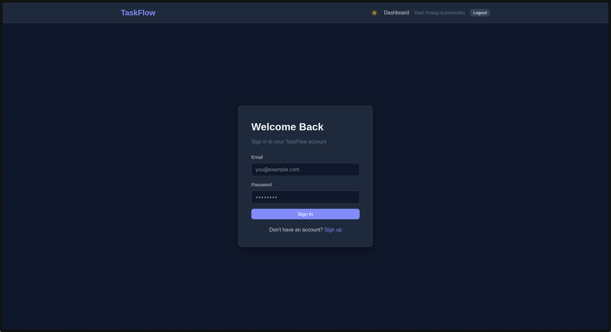
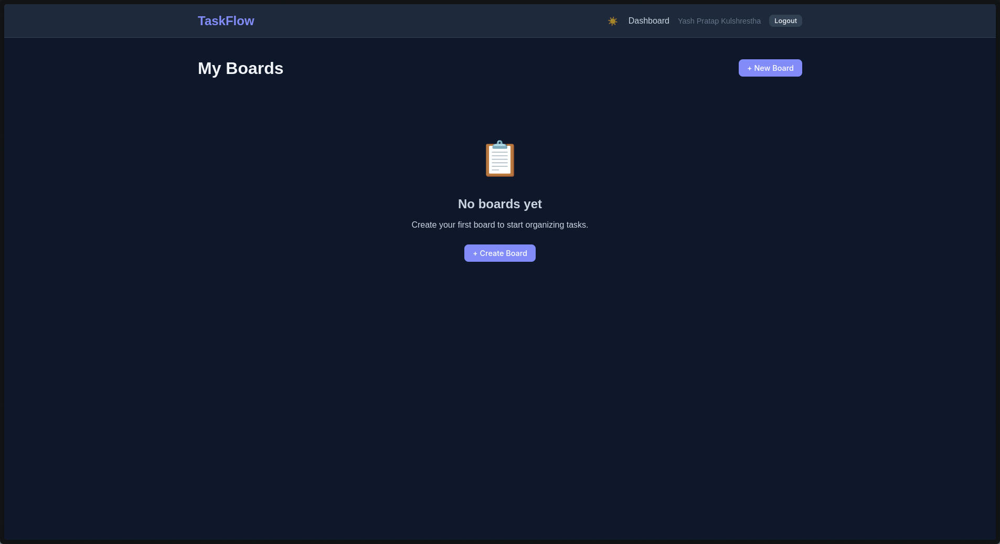
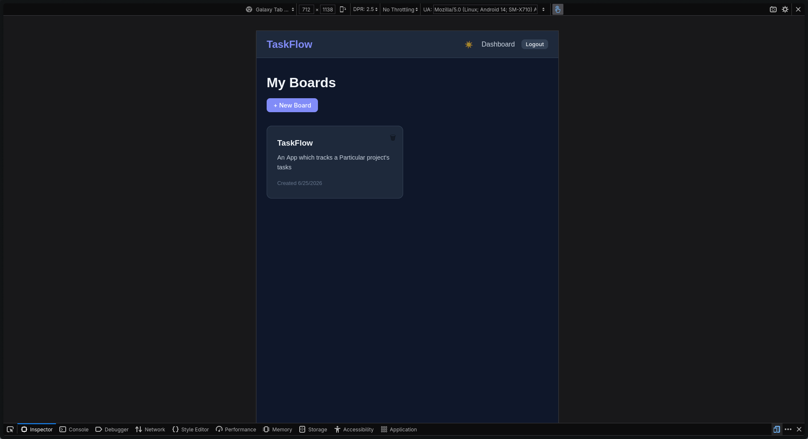
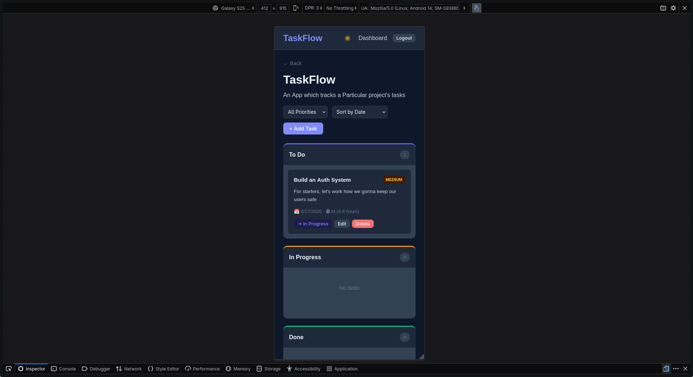

# TaskFlow - A Smart Task & Project Manager

A full-stack task and project management application built with the MERN stack. TaskFlow allows users to register and log in, create boards/projects, add tasks, organize them across status columns (To Do, In Progress, Done), set priorities and due dates, and track their work in a clean, responsive interface. Includes an AI-powered Smart Due-Date / Effort Estimate helper.

---

## Screenshots

### Login Page


### Dashboard


### Board View (Kanban)


### Mobile View


---

## Tech Stack

### Frontend
- **React.js v19** with functional components and hooks
- **React Router v7** for client-side routing
- **Axios** for API requests with interceptors
- **TypeScript** for type safety
- **Vite** as build tool
- Custom CSS with CSS variables for dark/light theming

### Backend
- **Node.js** with **Express.js v5** (REST API)
- **MongoDB** with **Mongoose v9** for data modeling
- **TypeScript** throughout
- **JWT** (jsonwebtoken) for authentication
- **bcrypt** for password hashing (12 rounds)
- **Zod** for request validation
- **Helmet** for security headers
- **express-rate-limit** for rate limiting
- **CORS** configuration

### Database
- **MongoDB Atlas** (cloud-hosted, free M0 tier)

### AI Integration
- **Google Gemini API** (gemini-2.0-flash) - free tier
- Falls back to local estimation if API is unavailable

---

## Features

### Authentication
- User registration with name, email, and password
- Login with JWT-based session
- Protected routes - unauthenticated users redirect to login
- Logout that clears the session

### Boards / Projects
- Dashboard listing all user boards as cards
- Create, rename, and delete boards (with confirmation prompt)
- Empty state with CTA when no boards exist

### Tasks & Board View
- Kanban-style board with 3 status columns: To Do, In Progress, Done
- Create tasks with title, description, priority, and due date
- Edit and delete tasks
- Move tasks between columns with one click
- Each task card shows title, priority badge, due date, and effort estimate
- Filter tasks by priority (All / High / Medium / Low)
- Sort tasks by creation date or due date
- Visual cue for overdue tasks (red border + date)

### AI Feature - Smart Due-Date / Effort Estimate
- "Suggest Estimate" button in the task creation/edit modal
- Sends task title and description to Google Gemini API from backend only
- Returns structured JSON with effort estimate, suggested due date, and reasoning
- User can accept the suggestion (pre-fills fields) or override it
- Graceful fallback if API fails or key is missing - app still works

### UI/UX
- Fully responsive design (mobile, tablet, desktop)
- Dark mode / Light mode toggle (persisted in localStorage)
- Loading skeletons while data is fetched
- User-friendly error handling
- Custom 404 page
- Clean, consistent color palette with CSS variables

---

## Project Structure

```
TaskFlow/
├── backend/
│   ├── src/
│   │   ├── config/
│   │   │   └── db.ts                 # MongoDB connection
│   │   ├── controllers/
│   │   │   ├── auth.controller.ts    # Register, login, getMe
│   │   │   ├── board.controller.ts   # Board CRUD
│   │   │   ├── task.controller.ts    # Task CRUD + move
│   │   │   └── ai.controller.ts      # AI suggestion endpoint
│   │   ├── middleware/
│   │   │   ├── auth.middleware.ts     # JWT verification
│   │   │   ├── validation.middleware.ts # Zod schema validation
│   │   │   ├── error.middleware.ts    # Global error handler
│   │   │   └── schemas.ts           # Zod validation schemas
│   │   ├── models/
│   │   │   ├── user.model.ts         # User schema
│   │   │   ├── board.model.ts        # Board schema
│   │   │   └── task.model.ts         # Task schema
│   │   ├── routes/
│   │   │   ├── auth.routes.ts
│   │   │   ├── board.routes.ts
│   │   │   ├── task.routes.ts
│   │   │   └── ai.routes.ts
│   │   ├── services/
│   │   │   ├── auth.service.ts
│   │   │   ├── board.service.ts
│   │   │   ├── task.service.ts
│   │   │   └── ai.service.ts         # Gemini API integration
│   │   ├── types/
│   │   │   └── index.ts              # TypeScript interfaces
│   │   └── index.ts                  # Entry point
│   ├── tests/
│   │   ├── setup.ts                  # MongoDB Memory Server setup
│   │   ├── auth.test.ts              # Auth endpoint tests
│   │   ├── board.test.ts             # Board endpoint tests
│   │   └── task.test.ts              # Task endpoint tests
│   ├── .env.example
│   └── package.json
├── frontend/
│   ├── src/
│   │   ├── api/
│   │   │   └── client.ts             # Axios instance + API functions
│   │   ├── components/
│   │   │   ├── Navbar.tsx
│   │   │   ├── ProtectedRoute.tsx
│   │   │   ├── TaskCard.tsx
│   │   │   └── TaskModal.tsx         # Task form + AI suggest button
│   │   ├── context/
│   │   │   ├── AuthContext.tsx        # Auth state management
│   │   │   └── ThemeContext.tsx       # Dark/light mode
│   │   ├── pages/
│   │   │   ├── Login.tsx
│   │   │   ├── Register.tsx
│   │   │   ├── Dashboard.tsx
│   │   │   ├── BoardView.tsx         # Kanban board
│   │   │   └── NotFound.tsx
│   │   ├── types/
│   │   │   └── index.ts
│   │   ├── App.tsx                   # Router setup
│   │   ├── App.css                   # All styles + dark mode
│   │   └── main.tsx
│   └── package.json
└── README.md
```

---

## Setup & Run Locally

### Prerequisites
- Node.js v18+ installed
- MongoDB Atlas account (free tier) OR local MongoDB

### 1. Clone the repository
```bash
git clone https://github.com/yourusername/taskflow.git
cd taskflow
```

### 2. Backend Setup
```bash
cd backend
npm install
```

Create a `.env` file from the example:
```bash
cp .env.example .env
```

Edit `.env` with your values:
```
PORT=3000
MONGODB_URI=mongodb+srv://<username>:<password>@cluster0.xxxxx.mongodb.net/taskflow?retryWrites=true&w=majority
JWT_SECRET=your-random-secret-string-here
JWT_EXPIRES_IN=15m
LLM_API_KEY=
LLM_API_URL=https://generativelanguage.googleapis.com/v1beta/models/gemini-2.0-flash:generateContent
NODE_ENV=development
```

Start the backend:
```bash
npm run dev
```

Server runs on `http://localhost:3000`.

### 3. Frontend Setup
```bash
cd frontend
npm install
npm run dev
```

Frontend runs on `http://localhost:5173` and proxies `/api` requests to the backend.

### 4. Run Tests
```bash
cd backend
npm test
```

---

## Environment Variables

| Variable | Required | Description |
|----------|----------|-------------|
| `PORT` | No | Server port (default: 3000) |
| `MONGODB_URI` | Yes | MongoDB connection string |
| `JWT_SECRET` | Yes | Secret key for JWT signing |
| `JWT_EXPIRES_IN` | No | Token expiry (default: 15m) |
| `LLM_API_KEY` | No | Google Gemini API key (AI feature works without it) |
| `LLM_API_URL` | No | LLM API endpoint URL |
| `NODE_ENV` | No | Environment: development / production |

---

## API Documentation

### Authentication

| Method | Endpoint | Body | Description |
|--------|----------|------|-------------|
| POST | `/api/auth/register` | `{ name, email, password }` | Register a new user |
| POST | `/api/auth/login` | `{ email, password }` | Login and receive JWT |
| GET | `/api/auth/me` | - | Get current user (requires token) |

### Boards

| Method | Endpoint | Body | Description |
|--------|----------|------|-------------|
| GET | `/api/boards` | - | List all user boards |
| POST | `/api/boards` | `{ title, description? }` | Create a board |
| GET | `/api/boards/:id` | - | Get a single board |
| PUT | `/api/boards/:id` | `{ title?, description? }` | Update a board |
| DELETE | `/api/boards/:id` | - | Delete board and its tasks |

### Tasks

| Method | Endpoint | Body | Description |
|--------|----------|------|-------------|
| GET | `/api/tasks/board/:boardId` | - | List tasks in a board |
| POST | `/api/tasks/board/:boardId` | `{ title, description?, status?, priority?, dueDate?, estimatedEffort? }` | Create a task |
| GET | `/api/tasks/:id` | - | Get a single task |
| PUT | `/api/tasks/:id` | `{ title?, description?, status?, priority?, dueDate?, estimatedEffort? }` | Update a task |
| DELETE | `/api/tasks/:id` | - | Delete a task |
| PATCH | `/api/tasks/:id/move` | `{ status }` | Move task between columns |

### AI

| Method | Endpoint | Body | Description |
|--------|----------|------|-------------|
| POST | `/api/ai/suggest` | `{ title, description? }` | Get AI effort/due-date suggestion |

**Note:** All endpoints except `/api/auth/register` and `/api/auth/login` require a JWT token in the `Authorization: Bearer <token>` header.

---

## AI Feature - How It Works

### LLM Choice: Google Gemini API (gemini-2.0-flash)

**Why Gemini:**
- Generous free tier (no credit card required)
- Fast inference with good quality responses
- Simple REST API integration
- Reliable uptime

### How it works:
1. User clicks "Suggest Estimate" in the task modal
2. Frontend sends task title and description to `POST /api/ai/suggest`
3. Backend constructs a prompt asking Gemini to analyze the task
4. Backend sends the prompt to Gemini API (API key never exposed to browser)
5. Response is parsed into structured JSON: `{ effort, suggestedDueDate, reasoning }`
6. User sees the suggestion and can click "Accept" to pre-fill the fields

### Fallback behavior:
If the API key is missing, the API call fails, or the response is malformed:
- Returns a local estimate based on task title word count
- Short titles (1-3 words) → Small effort (2-4 hours), 1 day due
- Medium titles (4-6 words) → Medium effort (4-8 hours), 3 days due
- Long titles (7+ words) → Large effort (8-16 hours), 5 days due
- The app works fully without AI - it's an enhancement, not a requirement

---

## Security Features

- **Password hashing** with bcrypt (12 salt rounds)
- **JWT authentication** with configurable expiry
- **Input validation** with Zod on all endpoints
- **Security headers** via Helmet
- **Rate limiting** (100 req/15min general, 10 req/15min for auth)
- **CORS** restricted to frontend origin
- **JSON body size limit** (10kb) to prevent payload attacks
- **Ownership enforcement** - users can only access their own boards/tasks
- **No secrets in code** - all via environment variables

---

## Test Credentials

For testing, you can register a new account directly in the app.

---

## Known Issues / Limitations

1. **No drag-and-drop** - Tasks are moved via buttons; drag-and-drop (dnd-kit) was not implemented due to time constraints
2. **No real-time collaboration** - Board updates are not synced across multiple users
3. **No pagination** - Task lists load all items; pagination would be needed for large boards
4. **No activity log** - Task changes are not tracked
5. **JWT expiry** - Token expires after 15 minutes; no refresh token mechanism implemented
6. **No board sharing** - Boards are single-user only

## What I Would Improve With More Time

1. Add drag-and-drop between columns using @dnd-kit
2. Implement refresh tokens for longer sessions
3. Add board collaboration (share with other users)
4. Add activity log / audit trail
5. Add task subtasks and tagging
6. Add pagination and search
7. Add dashboard charts (Recharts) for task analytics
8. Add WebSocket for real-time updates
9. Write more integration tests
10. Add Docker setup for easy deployment
